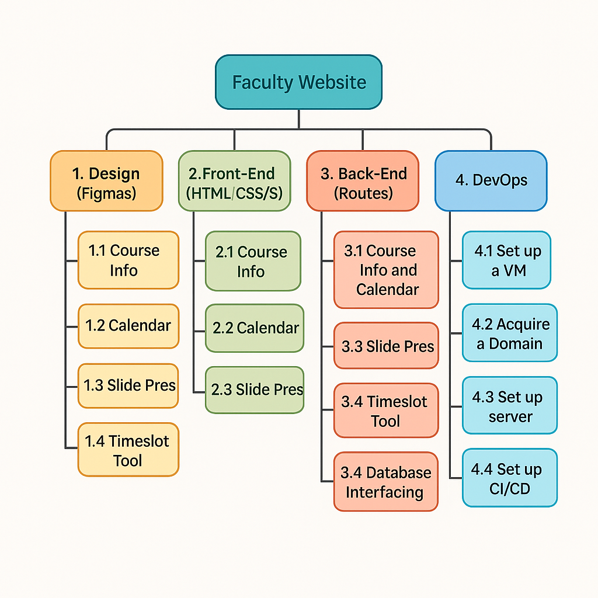

# Faculty's website

## 1. Introduction

This project aims at creating a website for a faculty member at a College setting. A number of tools to help with the delivery of courses will be included such as: a tool to allow students and/or groups of students to pick meeting timeslots, a tool to present informations about current courses being delivered, and a calendar of lectures.

*October 26th, 2025*

*Current Version: 3.1*

*Project Manager (and sponsor): Marcel Jar*

## 2. Overview

Marcel is planning to develop his own website to facilitate the delivery of his classes at Seneca Polytechnic.

### 2.1 Objective

A website designed for a faculty delivering courses at College setting will be up and running prior to the beginning of the Winter term with tools for allowing students and groups to pick meeting timeslots, presenting course inforamtion, and displaying a calendar of lectures.

### 2.2 Work Breakdown Structure

## 3. Milestones

1. List of technological choices for front-end, back-end, database, and hosting/domain defined
2. Website back-end up and front-end designed and some static test pages tested in development environment
3. Tool for allowing students and groups to pick timeslots designed and tested
4. Tool for presenting course information designed and tested
5. Tool for displaying course calendars designed and tested

## 4. Deliverables

1. Website up and running from the server with no interactive tools
2. Tool for students and groups to pick timeslots accessible for students
3. Course information pages accessible for students
4. Course calendars is now accessible for students
